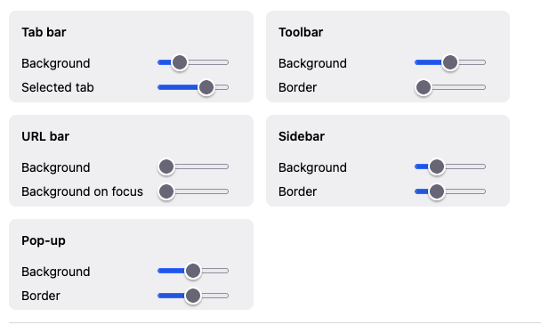
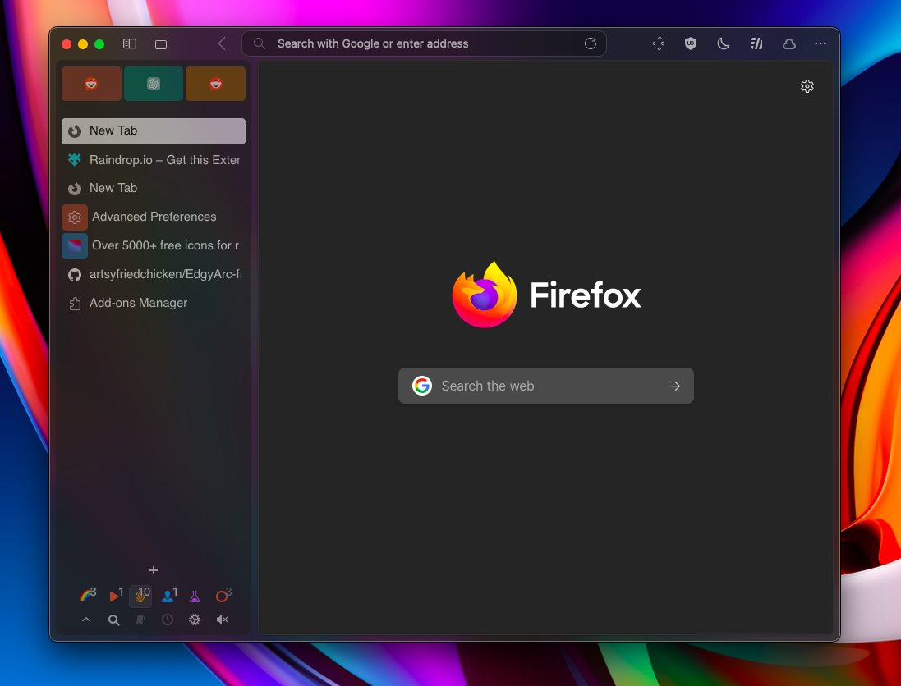
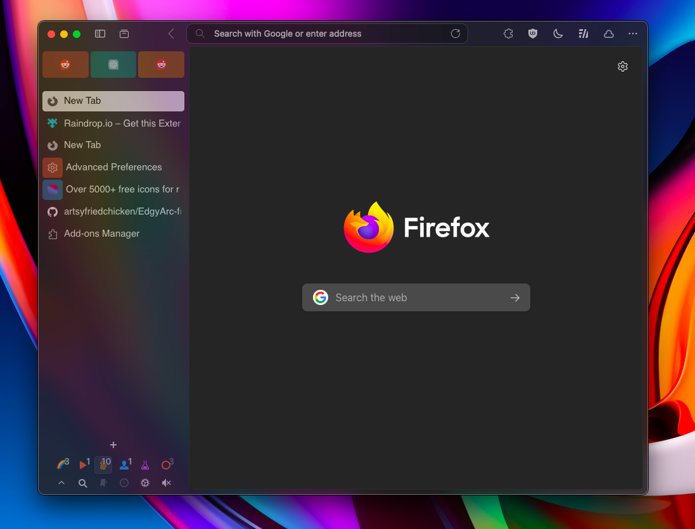
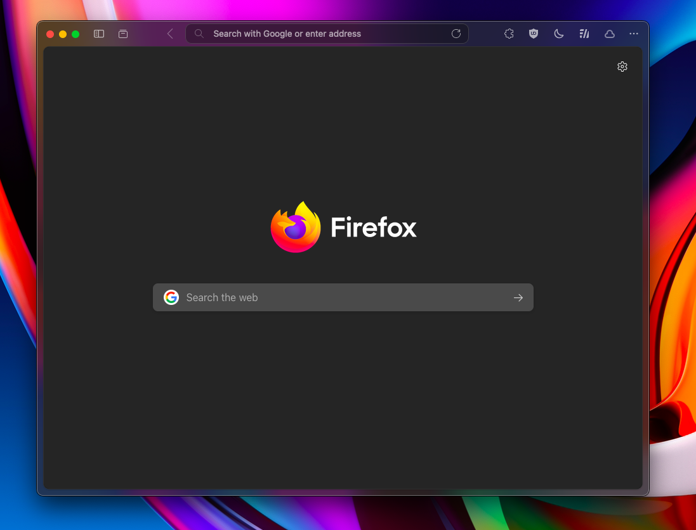
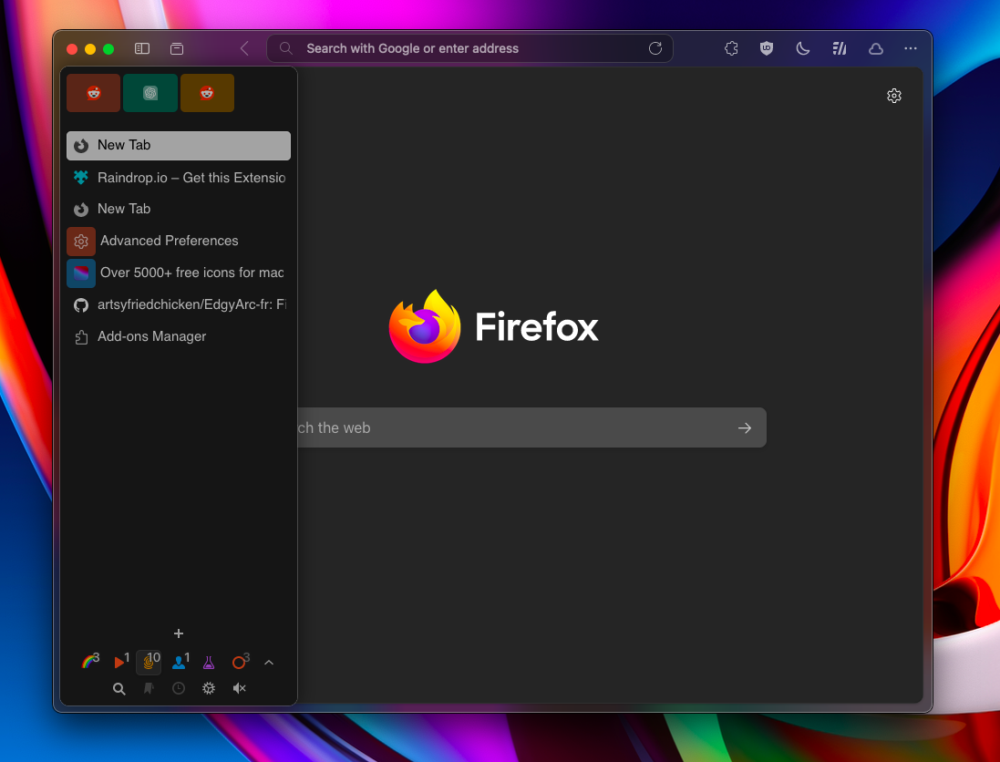
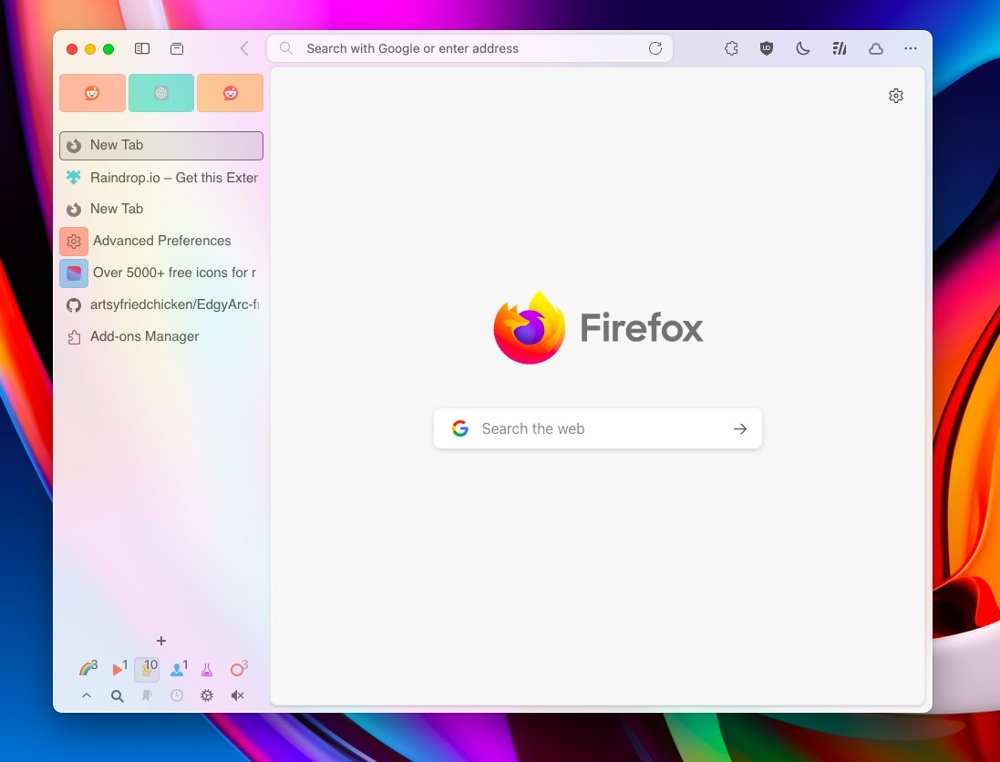

# EdgyArc-fr

Because Arc and Edge look pretty af but FOSS FTW

## Prerequisites

To use EdgyArc-fr to its fullest potential, ensure you have the following prerequisites:

- [EdgeFrFox UserChrome Theme](https://github.com/bmFtZQ/edge-frfox/) 
- [Sidebery](https://addons.mozilla.org/firefox/addon/sidebery/) 
- Recommended Addons:
  - [UserChrome Toggle](https://addons.mozilla.org/firefox/addon/userchrome-toggle/) 
  - [Adaptive Tab Bar Color](https://addons.mozilla.org/en-GB/firefox/addon/adaptive-tab-bar-colour/) 

## About

EdgyArc-fr is designed to enhance your Firefox user interface by combining the sleekness of Microsoft Edge and the aesthetics of the Arc theme. It incorporates minor tweaks to the EdgeFrFox theme, providing a unique and cohesive visual experience.

## Whats Included

### Minor Tweaks to EdgeFrFox Theme

- MOAR rounded corners, larger padding, and a bit more room to breathe.
- Adjusts sidebar styling to complement Sidebery.
- `Optional` auto collapsing sidebar.
- `Optional` fully hide sidebar when not hovered (like Arc browser)

### UserChrome Toggle Integration

- Easily switch between:
  - Autocollapse sidebar
  - Always expanded sidebar

### Sidebery Configurations

- Included settings and custom CSS for Sidebery
- main styling changes
  - horizontal panel nav bar moved from top to bottom
  - sidebery fades out when not hovered
  - simplified layout for when sidebar is collapsed
    - tabs only show favicons
    - compact pinned tabs layout
    - only active panel icon displayed in panel navigation bar
    - new tab button hidden because it cant be acted upon without expanding sidebar
  

## Usage

1. Install the [EdgeFrFox UserChrome Theme](https://github.com/bmFtZQ/edge-frfox/).
2. Install recommended addons: [Sidebery](https://addons.mozilla.org/firefox/addon/sidebery/), [UserChrome Toggle](https://addons.mozilla.org/firefox/addon/userchrome-toggle/), [Adaptive Tab Bar Colour](https://addons.mozilla.org/en-GB/firefox/addon/adaptive-tab-bar-colour/).
3. Clone or download the EdgyArc-fr repository to your local machine.
4. Copy the contents of the `chrome` folder into your Firefox profile's `chrome` folder.
5. Enable/Add the following settings in `about:config` to enable features in EdgeFrFox
   Make sure to initialise all of these as Bools
   - `uc.tweak.hide-tabs-bar` to `true`
   - `uc.tweak.hide-forward-button` to `true`
   - `uc.tweak.rounded-corners` to `true`
   - `uc.tweak.floating-tabs` to `true`
   Please make sure you also have the following prequisites enabled
   - `toolkit.legacyUserProfileCustomizations.stylesheets`
   - `svg.context-properties.content.enabled`
   - `layout.css.color-mix.enabled`
   - `layout.css.light-dark.enabled`
   - `layout.css.has-selector.enabled`
7. [optional] set up style variants
8. Import `sidebery-settings.json` and `sidebery-styles.json` into Sidebery (`Sideberry Settings` > `Help` > `Import Addon Data`)

## Style variants
### Fully Hide collapsed sidebar (like in Arc)
`uc.tweak.af.hidden-sidebar` > `true`
### Minimal (arc-like) sidebar 
`uc.tweak.af.translucent-arc` > `true` **[Recommended]**
### Show Sidebar Header
`uc.tweak.af.show-sidebar-header` > `true`
### Misc Variants
`uc.tweak.af.greyscale-webext-icons` > Turn all web extension icons greyscale when not hovered

## My Settings for Adaptive Tab Bar Color

## Screenshots

## Changelog
- v1.0.0-b7
  - Cleaned up code
  - Fixed sidebery css bug - dragging tabs would indicate incorrect drop location
  - fixed sidebery css bug - pinned tabs misaligned
  - Added feature - Show a styled sidebar header
    `uc.tweak.af.show-sidebar-header` > `true`
  - Added feature - Turn all web extension icons greyscale when not hovered
    `uc.tweak.af.greyscale-webext-icons` > `true`
  - Css tweak - Toolbar background images now fade away at the bottom so it doesnt look jarring
  - Css fix - show custom private window badge when tabbar is hidden
  - Css fix - fixed margins and paddings of buttons inside the urlbar
  - bug fix - extension dropdown sheets inside the urlbar now show properly when urlbar is not hovered
- v1.0.0-b6
  - cleaned up code
  - bugfixes
  - updated sidebery styles
- v1.0.0-b5
  - Rewritten most of the code for translucency in macos
  - Added new preference uc.tweak.af.hidden-sidebar to fully hide sidebar when autohde is turned on in Userchrome Toggle
  - Added new preferenceuc.tweak.af.translucent-enable to control translucency [mac only]
  - Added new preference uc.tweak.af.translucent-enable to enable arc-like translucent sidebar
  - Tweaked sidebery css

- v1.0.0-b4
  - Supports Adaptive Tab Bar Color in translucent windows enabled! 
- v1.0.0-b3
  - restyled horizontal navigation bar to make it look less crappy
  - coloured tabs only show colour behind favicon, and not the whole row
  - expand tab group icon now more visible
- v1.0.0-b2
  - added translucency support on macos
  - changed hover opacities and transitions on navigator-toolbox
  - fixed search bar placement in sidebery css
  - fixed 1px bug in sidebery css
- v1.0.0-b1
- initial release

## Issues and Contributions

If you encounter any issues or have suggestions for improvement, please [open an issue](https://github.com/artsyfriedchicken/EdgyArc-fr/issues). Contributions are always welcome!

## License

This project is licensed under the [Mozilla Public License 2.0](https://opensource.org/licenses/MPL-2.0).
